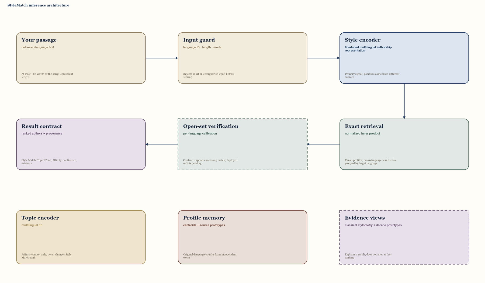

# StyleMatch architecture blueprint

Sources: [schema](docs/architecture/schema.yaml) · [Mermaid fallback](docs/architecture/diagram.mmd) · [deterministic SVG](docs/architecture/diagram.svg) · [browser preview](docs/architecture/diagram.html)

StyleMatch is an open-set author-profile retrieval system, not a closed-set authorship classifier. Its primary path compares a query’s style representation with source-separated author profiles. Topic similarity, classical stylometric observations, and experimental decade evidence remain visibly separate so they cannot be mistaken for the author-ranking signal.

## Module contracts

| Module | Responsibility | Input | Output | Non-goal |
| --- | --- | --- | --- | --- |
| Your passage | Accept the user’s delivered-language writing sample and requested retrieval mode. | Text, optional language, mode. | Query contract. | Translate, imitate, or enrich the text. |
| Input guard | Validate length, detect or confirm language, and select within/cross/global scope. | Query contract. | Validated text and ranking scope. | Produce an author guess. |
| Style encoder | Encode authorial habits with the deployed fine-tuned multilingual authorship model. | Validated original text. | Normalized style vector. | Score subject matter. |
| Topic encoder | Encode semantic proximity with multilingual E5. | The same validated text. | Topic vector and `TopicSim`. | Enter or reorder the Style Match ranking. |
| Profile memory | Hold normalized author-language centroids and per-source prototypes built from independent original-language works. | Frozen chunk and source artifacts. | Candidate profile vectors and provenance. | Treat mirrors, editions, or translations as independent evidence. |
| Exact retrieval | Compare the query style vector with compatible profile vectors and aggregate author candidates. | Query vector, profile vectors, target-language scope. | Ranked authors, scores, margins, cohort. | Compare raw cosine scores across uncontrolled language pairs. |
| Open-set verification | Turn ranking evidence into match/no-strong-match status when encoder-matched calibration is available. | Top scores, margins, language-specific calibrator. | Verification status and confidence metadata. | Present cosine as a probability. |
| Evidence views | Describe observable stylometry and an independently validated closest-decade prototype. | Query, ranked cohort, dated prototypes. | Explanatory observations and optional decade evidence. | Change author rank or fill unsupported decades. |
| Result contract | Return separate Style Match, Topic/Tone, Affinity, status, provenance, and rights-safe passages. | Ranking, verification, topic context, evidence. | Stable API/UI result. | Collapse heterogeneous signals into an unexplained percentage. |

## Boundary contracts

- `query → input_guard`: delivered-language text plus `within`, `cross`, or global mode.
- `style_encoder + profile_memory → retrieval`: normalized vectors produced by the same locked encoder revision.
- `topic_encoder → result`: `TopicSim` may contribute only to the declared Affinity rule; it cannot affect Style Match ordering.
- `retrieval → verification`: top score and margin must be calibrated per language against held-out authors. Calibration from another encoder is invalid.
- `evidence → result`: stylometric and decade fields carry their own support and experimental status; missing support returns `unavailable`.

## Design decisions

- Training positives come from the same author but different independent sources; source-heldout evaluation is the minimum leakage barrier.
- Original-language primary texts define profiles. A mirror, edition, or chunk of the same work does not add independent evidence.
- The deployed index uses exact normalized inner-product retrieval over cached vectors. Cross-language results remain grouped by target language.
- The topic model is physically and semantically separate from the style model. Current Affinity weights are declared product rules, not calibrated probabilities.
- The supplied `web/head.HEIC` portrait appears once on the entry view. Public-domain museum works form the results gallery strips; all are presentation assets, not architecture truth.

## Current gaps and review status

- Open-set verification is represented as a dashed boundary because the deployed challenger still needs encoder-matched per-language recalibration.
- Closest Decade remains experimental and must pass author-heldout support and accuracy gates before it is treated as available evidence.
- The project-local renderer generates the deterministic diagram, the no-JavaScript SVG fallback, and `web/static/method-flow.js` from `schema.yaml`; the Method page typesets that payload as one static, non-crossing ranking path plus three separate support planes.
- Method animation and node-level interaction are intentionally absent. Interaction belongs to passage matching and result comparison; the deterministic SVG/PNG remains the maintenance artifact and the website is the reading view.
